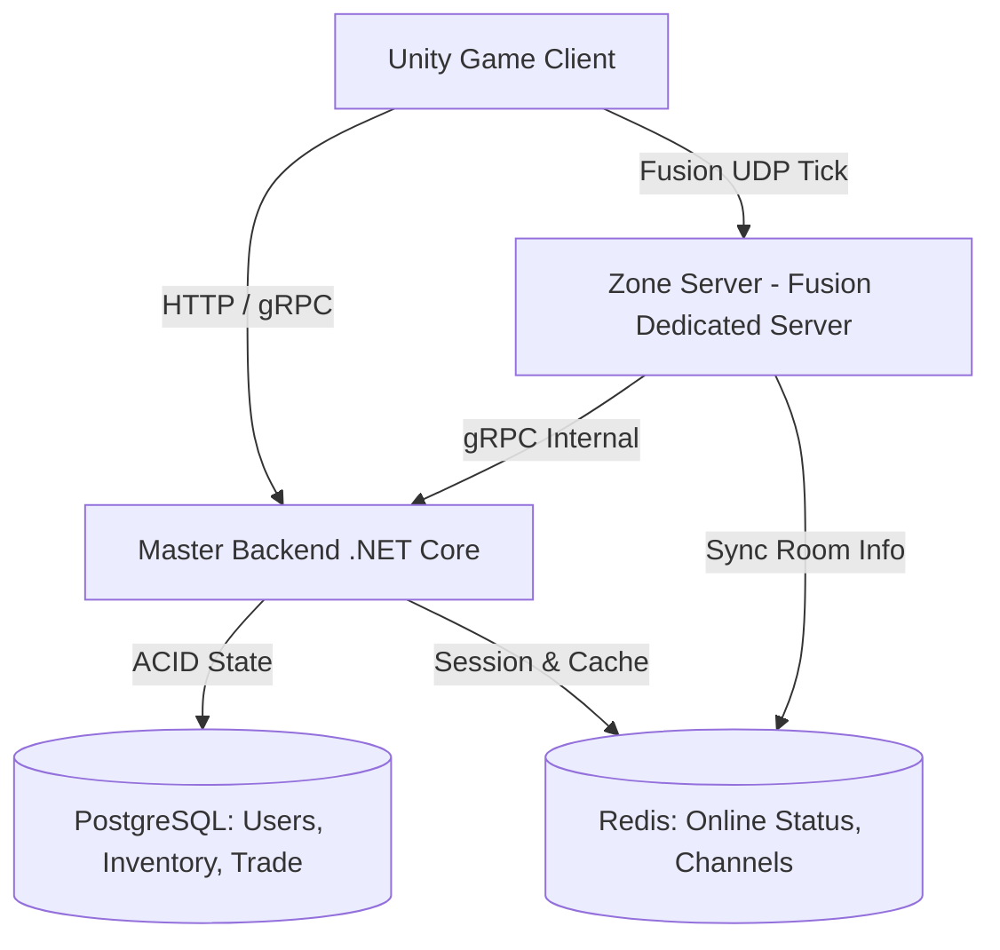
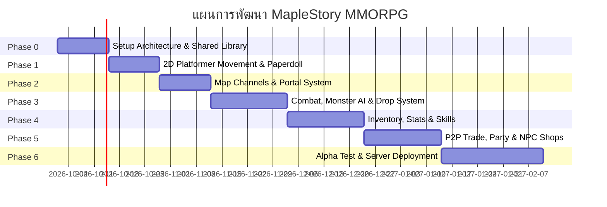

# 🍁 แผนแม่บทการพัฒนาเกม 2D MMORPG สไตล์ MapleStory

เอกสารฉบับนี้ร่าง Roadmap และสถาปัตยกรรมระบบทั้งหมดสำหรับการสร้างเกม **2D Side-scrolling Action MMORPG (MapleStory Style)** โดยใช้เทคโนโลยีระดับโปรดักชัน: **Unity + Photon Fusion + .NET Core Backend + PostgreSQL + Redis**

---

## 🏗️ 1. สถาปัตยกรรมระบบ (System Architecture)

MapleStory มีจุดเด่นคือการแบ่งโลกเป็น **"Map & Channel"** ซึ่งเข้ากับโมเดลห้องของ **Photon Fusion** ได้อย่างสมบูรณ์แบบ



### หน้าที่ของแต่ละส่วนประกอบ:
* **Unity Client:** จัดการ Input, การแสดงผลกราฟิก 2D, อนิเมชัน Paperdoll, ซาวด์, UI และ Local Prediction
* **Zone Server (Unity Headless + Fusion Dedicated Server):** 1 Instance รับผิดชอบ 1 หรือหลายแมพ (เช่น Henesys Ch.1) คุมฟิสิกส์การกระโดด/ปีนเชือก, มอนสเตอร์ AI, การคำนวณดาเมจ, ของดรอป
* **Master Backend API (.NET 8/9):** จัดการ Authentication, ระบบเศรษฐกิจ, คลังไอเทม, ระบบสุ่มกาชา, กิลด์, และระบบแลกเปลี่ยน (Trade)
* **Shared Library (C# .NET Standard):** ใช้ร่วมกันทั้ง Client, Server และ Backend เพื่อไม่ให้โค้ดสูตรคำนวณและโครงสร้างข้อมูลซ้ำซ้อน

---

## 🗺️ 2. แผนพัฒนาทีละเฟส (Phased Roadmap)



---

### 🔹 Phase 0: วางรากฐานและโครงสร้างโปรเจกต์ (สัปดาห์ 1 - 2)
> **เป้าหมาย:** สร้างท่อเชื่อมต่อข้อมูลระหว่าง Client, Server และ Database ให้สำเร็จก่อนเริ่มแตะตัวเกม

1. **โครงสร้าง C# Solution:**
   * `MyGame.Client` (Unity 6)
   * `MyGame.Server` (Unity Dedicated Server รันผ่าน Docker)
   * `MyGame.Shared` (Class Library: DTOs, Item Definitions, Damage Formulas)
   * `MyGame.Backend` (.NET Web API + gRPC)
2. **Database Schema Setup (PostgreSQL):**
   * ตาราง `accounts`, `characters`, `inventory_items`, `equipment_slots`, `skills`
3. **Photon Fusion Setup:**
   * สมัคร App ID และตั้งค่า Fusion Dedicated Server Mode
   * สร้างสคริปต์เชื่อมต่อ Lobby และการเข้าห้องตาม Map ID / Channel ID

---

### 🔹 Phase 1: ระบบเคลื่อนที่สไตล์ MapleStory & Paperdoll (สัปดาห์ 3 - 4)
> **เป้าหมาย:** บังคับตัวละครได้ลื่นไหล มีฟิสิกส์ 2D Platformer แท้ๆ พร้อมชุดแต่งตัว

1. **2D Platformer Movement Controller (Server-Authoritative):**
   * เดิน, วิ่ง, กระโดด (มีแรงโน้มถ่วงและแรงเฉื่อย)
   * **ระบบปีนบันได / ปีนเชือก (Ladders / Ropes):** เกาะเชือก, ไต่ขึ้น-ลง, กระโดดออกจากเชือก
   * **กระโดดลงพื้น (Fall-through One-way Platform):** กดปุ่มก้ม + กระโดด (`Down + Jump`)
   * **Client-Side Prediction:** ให้ผู้เล่นกดกระโดดแล้วตัวละครตอบสนองทันที 0ms โดยไม่รอ Server Confirm
2. **Modular 2D Paperdoll Avatar System:**
   * แยกเลเยอร์สไปรต์ตัวละคร: `Body` -> `Eyes` -> `Hair` -> `Face Acc` -> `Top` -> `Bottom` -> `Shoes` -> `Weapon`
   * สลับชุดและอาวุธแล้วอนิเมชันเปลี่ยนตามทันที

---

### 🔹 Phase 2: โลกของเกม, ระบบแมพ และวาป (Portals) (สัปดาห์ 5 - 6)
> **เป้าหมาย:** เดินข้ามแมพและเปลี่ยน Channel ได้เหมือนเกมจริง

1. **Map & Channel Manager:**
   * 1 แมพ = 1 Room Session ใน Fusion (เช่น `Henesys_Ch1`, `Henesys_Ch2`)
2. **Portal Transition System:**
   * เมื่อเดินชน Portal แล้วกดปุ่มลูกศรขึ้น (`Up`):
     * Fusion แจ้ง Client ยุติการควบคุม
     * ส่งพิกัดและ Map ปลายทางให้ Backend บันทึกชั่วคราวลง Redis
     * Client ออกจากห้องเดิมแล้วสลับไป Join ห้องของแมพปลายทาง
3. **Chat System พื้นฐาน:**
   * แชตทั่วไปรอบตัว (All/Map Chat), แชตซิบ (Whisper), แชตปาร์ตี้

---

### 🔹 Phase 3: การต่อสู้, มอนสเตอร์ และระบบของดรอป (สัปดาห์ 7 - 9)
> **เป้าหมาย:** ตีมอนสเตอร์แล้วมีตัวเลขดาเมจเด้ง มอนสเตอร์ตายแล้วของเด้งดึ๋งลงพื้น

1. **Monster Spawner & Server-side AI:**
   * มอนสเตอร์เดินลาดตระเวน (Patrol), ตกตามแพลตฟอร์ม, เลี้ยวกลับเมื่อชนขอบ
   * ระบบ Aggro: เดินเข้าใกล้แล้ววิ่งไล่กวดผู้เล่น
   * Respawn Timer อัตโนมัติเมื่อมอนสเตอร์ตาย
2. **Hit Detection & Damage Popups:**
   * ตรวจจับ Hitbox อาวุธฝั่ง Server (ใช้ Fusion Lag Compensation)
   * ตัวเลขดาเมจลอยขึ้นฟ้า (Damage Skins) พร้อมอนิเมชัน Critical Hit
3. **Maple-style Drop Physics:**
   * เมื่อมอนสเตอร์ตาย: เงิน (Meso) และไอเทมจะพุ่งกระจายออกจากตัวมอนสเตอร์แล้วตกลงพื้นแบบมีแรงเด้ง (Bouncing Physics)
   * **สิทธิ์การเก็บของ (Loot Ownership):** คนที่สร้างดาเมจสูงสุดได้สิทธิ์เก็บคนแรกเป็นเวลา 15 วินาที ก่อนจะเปิดให้ทุกคนเก็บได้

---

### 🔹 Phase 4: กระเป๋าไอเทม, สเตตัส และสกิล (สัปดาห์ 10 - 12)
> **เป้าหมาย:** เก็บเลเวล อัปสเตตัส สวมใส่อาวุธ และใช้สกิลเก็บเลเวล

1. **Inventory 5 แท็บคลาสสิก:**
   * `Equip` (อุปกรณ์สวมใส่)
   * `Use` (ยาปั๊มเลือด/มานา, ยาบัฟ)
   * `Etc` (ของดรอปจากมอนสเตอร์/เควสต์)
   * `Setup` (เก้าอี้นั่งพัก, ไอเทมพิเศษ)
   * `Cash` (แฟชั่น)
2. **Character Stats System:**
   * สเตตัสหลัก 4 ค่า: `STR`, `DEX`, `INT`, `LUK`
   * สเตตัสรอง: `Weapon Attack`, `Magic Attack`, `Defense`, `Speed`, `Jump`
3. **ระบบสกิล & Quick Slots (Hotkeys):**
   * ลากสกิล/ขวดยาไปวางที่ช่องปุ่มลัด (เช่น `Shift`, `Ctrl`, `Z`, `X`, `C`, `A`, `S`, `D`)
   * คูลดาวน์และค่า MP คำนวณฝั่ง Server

---

### 🔹 Phase 5: ระบบเศรษฐกิจ, การแลกเปลี่ยน และปาร์ตี้ (สัปดาห์ 13 - 15)
> **เป้าหมาย:** สังคมในเกม การเทรดที่ปลอดภัย ป้องกันการปั๊มไอเทม 100%

1. **Secure P2P Trade System (ป้องกันการปั๊มของ):**
   * หน้าต่างเทรด 2 ฝั่ง: ใส่ไอเทม -> กดยืนยัน (Lock) -> กด Trade
   * การโอนย้ายไอเทมและเงินทำผ่าน **PostgreSQL ACID Transaction**:
     ```sql
     BEGIN;
     -- ล็อคแถวข้อมูลของผู้เล่นทั้งสองฝ่าย
     SELECT * FROM characters WHERE id IN (player1_id, player2_id) FOR UPDATE;
     -- สลับไอเทมและหักเงิน
     UPDATE inventory ...
     COMMIT;
     ```
2. **Party System:**
   * สร้างปาร์ตี้ (สูงสุด 6 คน)
   * การหารค่า EXP ตามสัดส่วนเลเวลและดาเมจ
   * แสดงหลอดเลือดเพื่อนร่วมทีมบนหน้าจอ
3. **NPC Shop:**
   * คุยกับ NPC ร้านค้าเพื่อซื้อยาและขายของขยะ (Etc items) คืนเป็นเงิน Meso

---

### 🔹 Phase 6: ทดสอบ Alpha Test และเตรียม Host (สัปดาห์ 16+)
> **เป้าหมาย:** นำขึ้นเซิร์ฟเวอร์จริงและเปิดให้กลุ่มปิดทดสอบ

1. **Server Containerization (Docker):**
   * Build Unity Server เป็น Linux Headless Container
   * Deploy บน Cloud VM (เช่น Hetzner, AWS Lightsail หรือ DigitalOcean เพื่อคุมงบ)
2. **Anti-Cheat Heuristics (Server-Side):**
   * ตรวจสอบความเร็วการเดิน (Speed Check): ถ้าเดินทางเกินค่า `MaxSpeed * deltaTime` ปรับตำแหน่งกลับ
   * ตรวจจับคูลดาวน์สกิล (Skill Rate Limiting)
3. **Friends & Family Test:**
   * รันการทดสอบ 20–50 คนเพื่อดูความลื่นไหลของเน็ตเวิร์กและโหลดของฐานข้อมูล

---

## 🎯 จุดตัดสินใจสำคัญ (Key Decisions ที่ต้องเลือก)

| หัวข้อ | ตัวเลือก A | ตัวเลือก B (แนะนำ) |
| :--- | :--- | :--- |
| **สไตล์กราฟิก** | 2D Pixel Art แท้ๆ (งานเยอะ ต้องวาดทีละเฟรม) | **2D Skeletal Animation (Spine / Unity 2D Animation)** ทำชุดแฟชั่นง่าย ขยับโครงกระดูกได้ทันที |
| **มุมมองการเล่น** | 2D ด้านข้างระนาบเดียว (MapleStory 1) | 2.5D Isometric (Ragnarok) |
| **การจัดการห้อง Server** | 1 Server คุม 1 แมพ | **1 Server รันหลายแมพพร้อมกัน (Multi-Scene Hosting)** ประหยัดค่าเครื่องได้ 3–5 เท่า |
